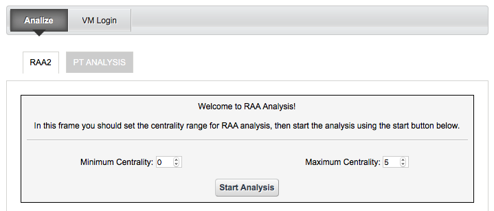
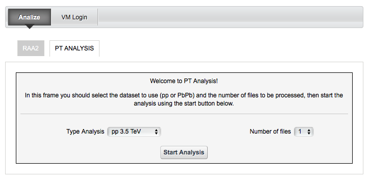
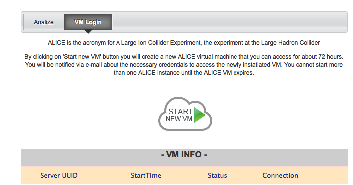
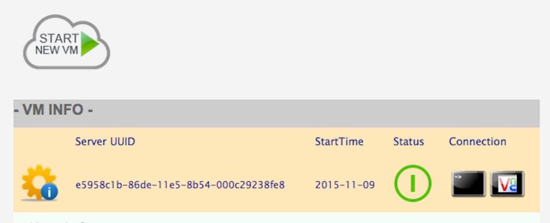

**************
ALICE ANALYSIS
**************

============
About
============

-------------

ALICE (A Large Ion Collider Experiment) is a heavy-ion detector designed to study the physics of strongly interacting matter at extreme energy densities, where a phase of matter called quark-gluon plasma forms.
The ALICE collaboration uses the 10,000-tons ALICE detector – 26 m long, 16 m high, and 16 m wide – to study quark-gluon plasma. The detector sits in a vast cavern 56 m below ground close to the village of St Genis-Pouilly in France, receiving beams from the LHC. As of today, the ALICE Collaboration counts 1,550 members from 151 institutes of 37 countries.
In this demonstrative application, you are able to select some ALICE datasets and run some analyses of the transverse momentum of charged particles in Pb-Pb collisions.

============
Installation
============
To install this portlet the WAR file has to be deployed into the application server.
In the application server must be installed Guacamole service to obtain VNC and SSH connections available from the portal.

============
Usage
============
The alice portlet interfaces presents two panes named: Analize and VMLogin

Analize
*******
In the Analize section the user can do or a RAA Experiment or a PT Analysis.
In the "RAA2" the user can choose the minimum and maximum centrality and replicate the analysis of the a dataset ALICE pressing the 'Start Analysis' Button.
In the "PT Analysis" the user can choose the dataset to use (pp or PbPb) and the number of files to be processed, then start the analysis pressing the 'Start Analysis' Button.

VM Login
********
In this section the user can obtain the access to an ALICE Virtual Machine hosting the whole environment in order to extend the analysis introducing new algorithms or new analisys files.
 
 

Pressing the 'Start VM' button, a new virtual machine will be started and associated to the user.

Once available the VM, two image buttons representing a console and the VNC logo inside a monitor, allow respectively to connect the VM to an SSH console or into a VNC session from the portal. In any case the information about how to connect the VM will be sent to the suer via email including the necessary credentials.

.. image:: images/pane2_2_2.png

============
Contributor(s)
============
To get support such as reporting a bug, a problem or even request new features, please contact

.. _INFN: http://www.ct.infn.it/

:Authors:
 
 `Roberto BARBERA <mailto:roberto.barbera@ct.infn.it>`_ - Italian National Institute of Nuclear Physics (INFN_),
 
 `Riccardo BRUNO <mailto:riccardo.bruno@ct.infn.it>`_ - Italian National Institute of Nuclear Physics (INFN_),

 `Rita RICCERI <mailto:rita.ricceri@ct.infn.it>`_ - Italian National Institute of Nuclear Physics (INFN_),

 `Carla CARRUBBA <mailto:carla.carrubba@ct.infn.it>`_ - Italian National Institute of Nuclear Physics (INFN_),

 `Giuseppina INSERRA <mailto:giuseppina.inserra@ct.infn.it>`_ - Italian National Institute of Nuclear Physics (INFN_),

